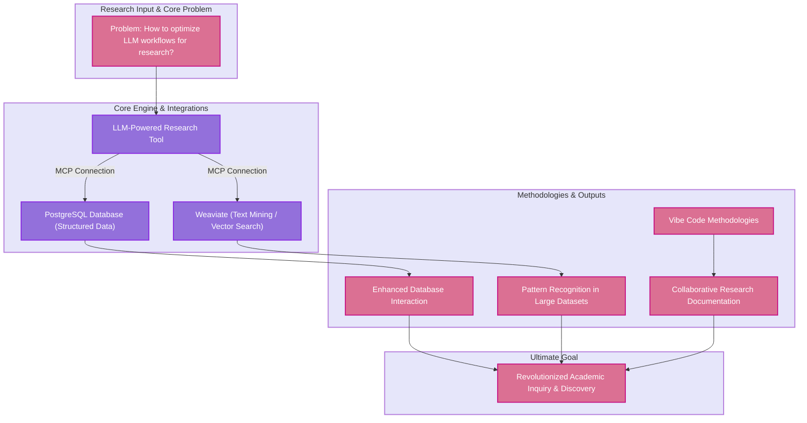

## Assignment 2: Introduction to your Research

### Purpose: 

My lab’s research investigates how LLMs1 can be enhanced with MCP2 connections to create powerful research tools that hopefully revolutionize academic inquiry and discovery. The work focuses on integrating LLMs1 with PostgreSQL3 databases, and text mining capabilities via Weaviate4 MCP2 connections. In simpler terms, this project is like teaching super-smart computer assistants to connect with different databases and research tools effectively, so they can help scientists find information, discover new patterns, and document their work more effectively than ever before.

### Prior Research

 Limited research exists on the integration of MCPs2 with LLMs1 for academic research applications, though foundational work has been established in database-LLM1 integration and text mining. _Amer-Yahia et al. (2023)_ [1] explored the intersection of large language models and database research, raising important questions about how LLMs1 and database systems can enhance each other in research contexts. Additionally, recent work on DB-GPT has demonstrated the potential for LLMs2 to revolutionize data management systems by serving as intelligent interfaces between users and databases _Zhou, X., Sun, Z. & Li,(2024)_ [2]. Research examining LLM1 integration into scientific workflows has highlighted both opportunities and challenges in incorporating these technologies into academic research practices _Marcel Binz, Stephan Alaniz, Adina Roskies, Balazs Aczel, Carl T Bergstrom, Colin Allen, Daniel Schad, Dirk Wulff, Jevin D West, Qiong Zhang, Richard M Shiffrin, Samuel J Gershman, Vencislav Popov, Emily M Bender, Marco Marelli, Matthew M Botvinick, Zeynep Akata, Eric Schulz (2025, February 4) [3]_. However, research combining MCP2 protocols, database integration, and collaborative research documentation remain largely unexplored, representing a significant gap that our research aims to address.

### Need For Study 

This research will significantly advance our understanding of how cutting-edge AI systems can be practically implemented to enhance research productivity. By developing and testing MCP2-enhanced LLM1 workflows, this study expects to demonstrate measurable improvements in research efficiency, pattern recognition in large datasets, and the ability to collaborate during research. The integration of Vibe Code5 methodologies with traditional research approaches could transform how researchers interact with Artificial Intelligence and generate insights.

#### Problem Statement: 

How can Model Context Protocol integrations with state-of-the-art LLMs be optimized to create comprehensive research workflows that enhance database interaction  and collaborative documentation for researchers?

Hypothesis 0: [null hypotheses here]\

### Key and definitions:
LLMs1 – “Large Language Models” aka powerful Artificial Intelligence systems that are trained on vast amounts of text data to understand, generate, and manipulate human language

MCP2 – “Model Context Protocol” aka an open standard that helps Artificial Intelligence systems access and interact with external tools like databases and other applications. MCPs help your standard LLM be more helpful and versatile, as they access your applications and automatically change anything that needs to be altered.
PostgreSQL3 – An open-source object-relational database management system (ORDBMS) known for its reliability, data integrity, and extensive feature set _Ali, M (2024, July 3)_ [4].

Weaviate4 – Weaviate is an open-source vector database that simply reads all of the files you import and is able to comprehensively interpret the data inside them, answering questions about the data with no difficulty.

Vibe Code5 – Vibe Coding is the process of using the help of different LLMs to generate and edit code. With the extensive use of MCPs, a vibe coder can also save the edited code to their own applications, watching the change happen in real time.

graph TD
    subgraph "Research Input & Core Problem"
        A["Problem: How to optimize LLM workflows for research?"]
    end

### References

[1] Torkamaan, H., Steinert, S., Pera, M. S., Kudina, O., Freire, S. K., Verma, H., … Oviedo-Trespalacios, O. (2024). Challenges and future directions for integration of large language models into socio-technical systems. Behaviour & Information Technology, 1–20. [https://doi.org/10.1080/0144929X.2024.2431068](https://doi.org/10.1080/0144929X.2024.2431068)

[2] Zhou, X., Sun, Z. & Li, G. DB-GPT: Large Language Model Meets Database. Data Sci. Eng. 9, 102–111 (2024). [https://doi.org/10.1007/s41019-023-00235-6](https://doi.org/10.1007/s41019-023-00235-6)

[3] Binz M, Alaniz S, Roskies A, Aczel B, Bergstrom CT, Allen C, Schad D, Wulff D, West JD, Zhang Q, Shiffrin RM, Gershman SJ, Popov V, Bender EM, Marelli M, Botvinick MM, Akata Z, Schulz E. How should the advancement of large language models affect the practice of science? Proc Natl Acad Sci U S A. 2025 Feb 4;122(5):e2401227121. doi: 10.1073/pnas.2401227121. Epub 2025 Jan 27. PMID: 39869798; PMCID: PMC11804466.

[4] Ali, M, What Is PostgreSQL? How It Works, Use Cases, and Resources, (2024). [https://www.datacamp.com/blog/what-is-postgresql-introduction](https://www.datacamp.com/blog/what-is-postgresql-introduction)
