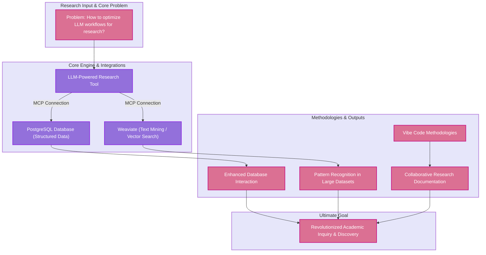

## Assignment 3: Materials and Methods 

My procedure is to compare traditional research methods against MCP enhanced LLM
workflows by having researchers use the server my lab and I created and measure the
differences in speed, accuracy, and output quality. Our study involves connecting LLMs to
PostgreSQL and Weaviate Databases through Model Context Protocols, then testing how well
this integrated system performs on typical research activities like database queries, literature
searches, and collaborative documentation – in comparison to conventional methods. This
direct approach was chosen because it could provide clear, measurable evidence of whether AI
based technology can actually improve research productivity in real-world scenarios.

We use PostgreSQL because it handles complex datasets reliably, which researchers are sure
to encounter. And Weaviate was chosen for its ability to search through documents and interact
with the user using natural language, rather than just keywords. The MCP connections allow the
LLM to access data from the researcher's own system, making a more efficient use of their time.
Vibe Coding is the primary way to communicate with the systems, because we do not expect
researchers to learn complex database programming languages, instead using normal language
for smooth interaction.

