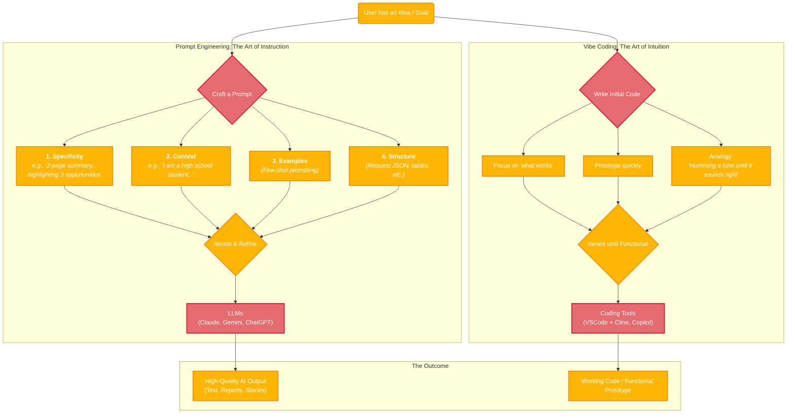

###### If you haven't already, be sure to visit my [Here's what it's about](hereswhatitsabout.md) page. It has an extensive background on our research with definitions to important words that will be used here!

## Prompt Engineering
"It's a relatively new field of research that refers to the practice of designing, refining, and implementing prompts or instructions that guide the output of large language models (LLMs) to help in various tasks" _Mesko, B (2023)_ [1]. Prompt Engineering is the skill of crafting clear, effective instructions for Aritficial Intelligence systems. I have taken a particular liking to using Claude AI and Gemini, but there are many different AIs you can work with, like Chat GPT, Perplexity, and even GitHub Copilot. 
Instead of just prompting "write me a story," a good prompt engineer might say "write a 500-word mystery story set in 1920s Paris, told from the perspective of a detective who speaks in short, clipped sentences." The better your prompt, the better results you'll get from the AI.

### Here's a few things I learnt by Prompting everyday...
Specificity matters enormously. Instead of "write a report," try "write a 2-page executive summary analyzing PostgreSQL sales data, highlighting the top 3 growth opportunities and 2 main challenges, formatted with bullet points and aimed at daily consumers."

Context shapes everything. Providing background information, your role, the intended audience, and desired outcome helps the AI understand not just what you want, but why you want it. "I'm a high school student preparing a lesson on AI for other students" will get you very different content than "I'm a Univesity intern researching the use of Artificial INtelligence in Research for a presentation to PHD holders."

Examples are incredibly powerful. Showing the AI what good output looks like through examples (few-shot prompting) often works better than lengthy descriptions. If you want a specific writing style, provide a sample paragraph.

Iterative refinement is normal. Prompt engineering isn't about getting it perfect on the first try - most of the time you start with a decent prompt and refine it based on what you get back. Maybe you need to add constraints, clarify tone, or provide more context.

Structure and formatting help. Using clear sections, asking for step-by-step thinking, or requesting specific output formats (like JSON, tables, or numbered lists) can dramatically improve results.

## Vibe Coding
"“Vibe coding” is introduced by renowned Computer scientist  Andrej Karpathy in February 2025 and emphasized the significance of AI tools in software development. This concept is in line with developments in artificial intelligence (AI) technologies, especially large language models (LLMs) like ChatGPT, Claude and OpenAI's Codex to help developers stay in the zone of creativity and automate coding works" _Harkar, S (2025)_ [2]

A more relaxed, intuitive approach to programming where you focus on getting something that works rather than writing perfect, optimized code. It's about coding based on what information you currently have - maybe you're not sure of the exact syntax, but you write something that captures the general idea and then iterate until it works. I think of it as the programming equivalent of humming a tune you can't quite remember until it sounds right. It's especially popular when prototyping or when you just want to quickly test an idea without getting bogged down in best practices.

I've been using a specific coding tool named Cline which I access through a platform called VScode, and write code with it to complete projects.

    

#### References:
[1] Meskó B, Prompt Engineering as an Important Emerging Skill for Medical Professionals: Tutorial, J Med Internet Res 2023;25:e50638, URL: [https://www.jmir.org/2023/1/e50638](https://www.jmir.org/2023/1/e50638), DOI: 10.2196/50638

[2] Harkar S, What is Vibe COding, 2025 April 8, [https://www.ibm.com/think/topics/vibe-coding](https://www.ibm.com/think/topics/vibe-coding)
